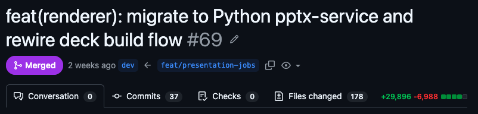
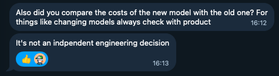

Some months ago, I was asked to build an AI-powered presentation generation tool. My first reaction was skepticism, and I kept asking myself: How do you generate a presentation with AI? How does it work technically? And honestly, I didn't know where to begin.

I spent most of my time questioning whether this was actually possible, and later figured out it was. In this post, I'll walk you through that journey, breaking down the uncertainty, experiments, hard decisions that shaped the system and how everything ultimately came together.

## The Product Argument

While sitting with that skepticism, I built a few prototypes. My early conclusion was that HTML-based slides with a WYSIWYG editor made the most sense. During that exploration, I came across [Anthony Fu's Slidev](https://sli.dev/)⁠, and it reinforced a broader assumption at the time: if models are good at generating code, then slides as code was the right abstraction.

Considering the product angle, lock-in also felt like a strong advantage. Users would build, edit, and share presentations without relying on any third-party software. Committing fully to this direction, I shared my thoughts with my product lead, expecting alignment, but the conversation that followed completely shifted the direction of the product.

He pushed back by framing it through existing enterprise workflows and the tools teams already rely on. The goal wasn't lock-in or forcing adoption of a new system, but rather getting teams from zero to about 80% of a usable deck, and letting them finish the rest in tools they already know. 

## Building the Product 

Having PPTX output as a non-negotiable part of the system, I started with [`pptxgenjs`](https://gitbrent.github.io/PptxGenJS/), generating PPTX files from JSON and building React components that approximated what the file would look like.

There was a real gap between the preview and the actual PPTX. Layouts shifted, text overflowed, and spacing was wrong. The preview was a lie, and the application UX was built around it. I had to accept it as an interim trade-off since native PPTX rendering in the browser doesn't exist yet.

At this point, one milestone had been ticked. It was possible to generate a presentation with AI. But I needed more than that. The current pipeline had no visual structure. Each slide looked completely different from the others. Brands rely on style guides, design systems, and templates, and that introduced a new set of requirements, making the product harder to build, especially since the gap between previews and the final PPTX output looking different was yet to be addressed.

Building a visually consistent presentation led me to [`pptx-automizer`](https://github.com/singerla/pptx-automizer), which works with editing existing PPTX files as templates rather than generating from scratch. But I was not prepared for the problems that came with it.

A PPTX file is a ZIP archive full of layered XML, and text replacement is very unreliable since placeholders don't always exist where you'd expect them to be. As a result, even small changes often produced broken files.

I started looking for a new approach that could solve most of the issues I was running into. Eventually, I rewrote the service using python-pptx. This was the most hectic part of the project. I tore everything apart and rebuilt the preview rendering engine and the PowerPoint generation pipeline in a completely new stack.

PR #69 captured the full migration. It was a Python microservice that could edit PPTX files reliably, and a rendering engine that removed the drift between preview and final output. 

Everything else became easy. I had consistent outputs that followed brand guidelines and existing templates, and the renderer converted the PPTX to PDF and PNG, which I could then preview in the browser.

I made minor improvements to the pipeline, introducing outline generation using the SCR framework, web search, and a QA verification loop.

I began running evals on the new system immediately, but testing started getting expensive. I wanted to know if a cheaper open-source model could handle the same workload.

So I switched to OpenRouter, testing different models in the new harness, but benchmark scores don't translate to behavior in a multi-step agentic pipeline. The success rate on tool calls was roughly 2 in 10, and failed attempts burned tokens, stalled the pipeline, and ended up costing more than they saved. None of the models stayed.

This also made clear that model selection isn't purely an engineering decision. It touches cost, latency, and output quality, all of which are product concerns.

The final decision landed on Claude Sonnet 4.6, which gave consistent outputs without degrading performance or quality.

## The Architecture and Stack

Not much went into deciding the tech stack. I stuck with defaults I ship fast with: Next.js on the frontend and Convex for backend, database, sync, and file storage. Auth was handled via WorkOS, aligning with the decision targeting enterprise users.

The renderer and PPTX generation engine, built as a long-running process, landed on Fly.io paired with Upstash Redis, reused in the Vercel/Next.js layer for resumable streams.

Turborepo sits as the glue across all services, managing shared packages, dependencies, and coordination between the frontend, backend, and rendering pipeline.

For payments, Stripe. Nothing to explain there.

Model routing goes through OpenRouter, with the Vercel AI SDK for the orchestration layer, custom harness and pipeline.

## Where Things Stand

[DeckSense](https://decksense.ai) is currently live with early users, but there are still rough edges. The template engine has known limitations I haven't addressed, the open-source model question is still open. But the core pipeline works, and that's something I'm proud of. 

conversation → outline → brand guidelines → PPTX.

## Final Thoughts

What I walked away with isn't a clean architecture or a perfect pipeline, but a sharper instinct for when to start over, when to accept a trade-off and move on, and how much of the hard work in building a product has nothing to do with code. Picking the right abstraction matters, but so does knowing when to abandon one.

*Ajared Research is an applied AI studio. If you're building something with AI and want a second opinion on the architecture or product direction, [let's talk](https://ajared.ca/talk/).*
